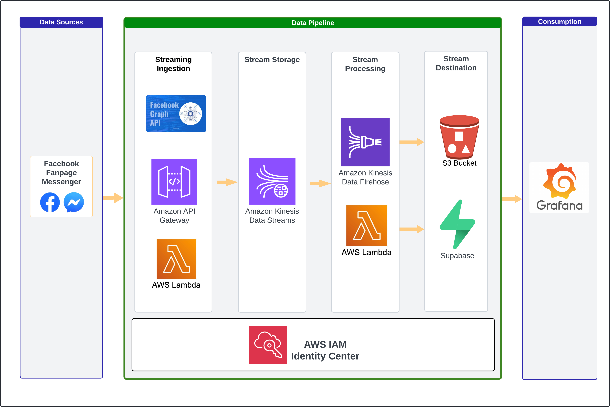
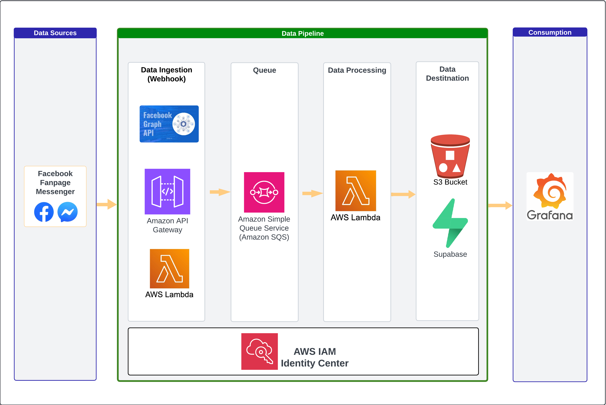

# Facebook Fanpage Streaming Order Platform

Stream and track order data from Facebook fanpages in real-time using AWS services for efficient processing and storage. This project integrates Facebook's Webhook, AWS API Gateway, Lambda, Kinesis, SQS, and S3.

---
###  **Problems**

The restaurant faces significant inefficiencies in its order management process:

1. **Customer Communication Burden** – Staff must be online 24/7 on the Facebook Fanpage Messenger to respond to customer inquiries, which is resource-intensive and difficult to maintain.

2. **Manual Order Processing** – Orders are manually collected from chat messages and recorded into Excel by an admin, consuming time and effort.

3. **Data Inaccuracy** – Manual data entry increases the risk of errors, leading to incorrect order records, reporting issues, and operational delays.

4. **Time Wastage** – The current workflow slows down order processing and creates unnecessary bottlenecks between customers, the admin, and the chef.

---


### **Main Architecture**


1. **Facebook Messenger Webhook 💬**
   Captures real-time events from Facebook Fanpage Messenger using the Facebook Graph API.

2. **Amazon API Gateway 🌐**
   Serves as the entry point for webhook events from Facebook, providing a secure and scalable endpoint.

3. **AWS Lambda (Webhook Handler) ⚙️**
   Processes and transforms incoming events before forwarding them to the streaming service.

4. **Amazon Kinesis Data Streams 🔄**
   Stores streaming data temporarily to ensure reliable and ordered message processing.

5. **Amazon Kinesis Data Firehose 🔥**
   Automatically delivers streaming data to destination services like S3 and Lambda for further processing.

6. **AWS Lambda (Processor) 🧠**
   Performs additional logic or transformation before inserting the data into the destination.

7. **S3 + Supabase 📦⚡**
   S3 stores raw and processed data for analytics; Supabase enables fast querying and dashboard integration.

8. **Grafana 📊**
   Visualizes data from Supabase or S3, enabling real-time monitoring and insights.

9. **AWS IAM Identity Center 🔐**
   Handles authentication and access control across the entire pipeline.

---

### **Alternative Architecture (Early Stage)**

In the initial stage, replace Kinesis Streaming and Firehose with AWS SQS for message queuing and AWS Lambda for processing:



The order data flows through the following sequence:

1. **Facebook Messenger Webhook 💬**
   Receives messages or events from Facebook Fanpage Messenger using the Facebook Graph API.

2. **Amazon API Gateway 🌐**
   Exposes a secure HTTP endpoint to receive webhook data from Facebook.

3. **AWS Lambda (Webhook Handler) ⚙️**
   Processes and validates the webhook payload and forwards it to the message queue.

4. **Amazon SQS 📩**
   Acts as a buffer and decouples ingestion from processing by queuing the incoming messages.

5. **AWS Lambda (Processor) 🧠**
   Consumes messages from SQS, transforms the data, and routes it to appropriate storage destinations.

6. **S3 + Supabase 📦⚡**
   Stores processed data: S3 for raw/archive data and Supabase for structured querying and analysis.

7. **Grafana 📊**
   Visualizes and monitors the data for insights and reporting.

8. **AWS IAM Identity Center 🔐**
   Manages authentication and authorization across all integrated AWS services.

---

## Prerequisites

* Facebook Developer Account
* AWS Account with permissions for API Gateway, Lambda, Kinesis, SQS, and S3

---

## Getting Started

1. **Clone the repository:**

   ```bash
   git clone https://github.com/your-username/fb-fanpage-streaming-order.git
   ```

2. **Set up the necessary AWS services**
   Follow the instructions in the documentation to set up AWS API Gateway, Lambda functions, and S3 bucket.

3. **Configure the Facebook Webhook**
   Set up the Webhook URL in the Facebook Developer portal to point to your AWS API Gateway endpoint.

4. **Deploy the Lambda functions**
   Use AWS SAM or Serverless Framework for deployment.

